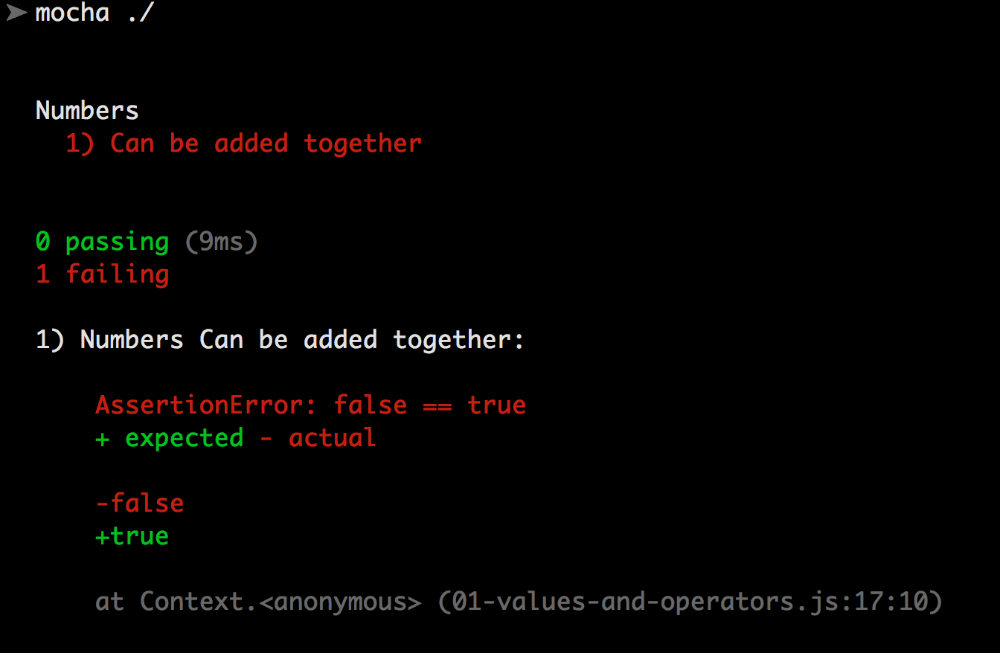

# learning-js

## Setting up a local test environment

1. Download and install [Node.js](https://nodejs.org/)
2. Run the command `npm --version` in the terminal and make sure it does return any errors. It should print out your version of Node's Package manager. For example:
        ➤ npm --version
        3.3.12
3. Run the command `npm install -g mocha` to install the test library.
4. Check that mocha is installed properly by running `mocha --version`, which should print out the version of mocha that you have just installed.

## Running the tests.

1. In the terminal, navigate to the folder containing this file on your computer.
2. Run the command `mocha ./`. You should see something like the following:

You can also let Mocha run tests for you automatically when your files change by running the `mocha -w ./` command.

